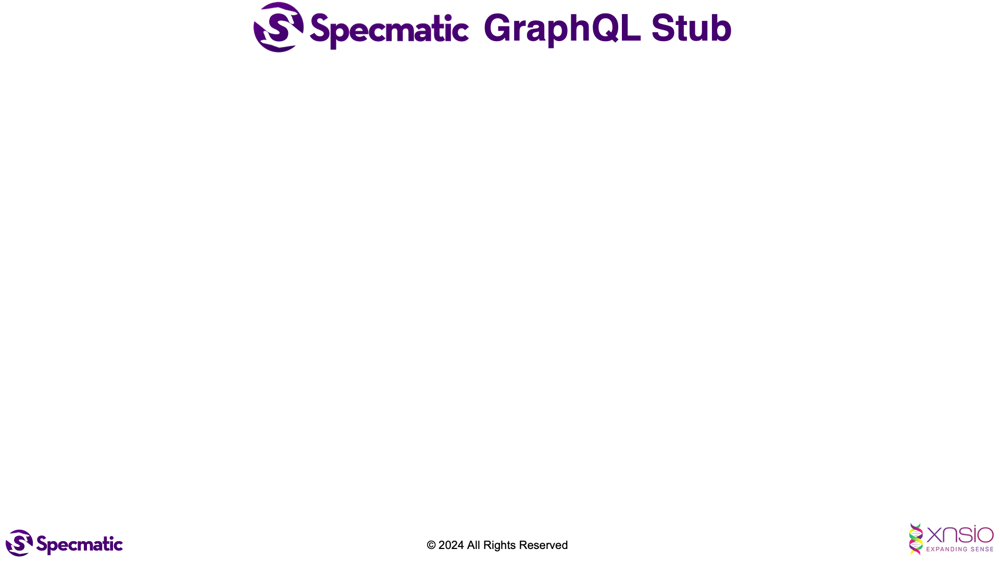

# Specmatic UI project for GraphQL demo

## Run the tests

1. Using gradle -
    ```shell
    ./gradlew clean test
    ```
2. Using docker -
   - Start Docker Desktop
   - Start the graphql service stub using
     ```shell
     docker run -v "$PWD/specmatic.yml:/usr/src/app/specmatic.yml" -v "$PWD/src/test/resources/specmatic/graphql/examples:/usr/src/app/examples" -p 8080:8080 znsio/specmatic-graphql virtualize --port=8080 --examples=examples
     ```
   - Run the application - `./gradlew bootRun`
   - Run the tests -
     ```shell
     docker run --network host -v "$PWD/specmatic.yml:/usr/src/app/specmatic.yml" -v "$PWD/build/reports/specmatic:/usr/src/app/build/reports/specmatic"  znsio/specmatic test --port=8070 --host=host.docker.internal
     ```

Look at the `ContractTest` class to see how the GraphQL dependency has been stubbed out.

## Start the application

1. Checkout the Order API project from [here](https://github.com/znsio/specmatic-order-api-java), and start it up using the instructions in it's README. 
2. Checkout the BFF project from [here](https://github.com/znsio/specmatic-order-bff-graphql-java), and start it up using the instructions in it's README.
3. Execute this command:

```shell
./gradlew bootRun
```
